# 뉴스 파이프라인 로직·운영 프로세스

> 2026-10-01 코드 기준. 이 문서는 전체 처리 순서와 단계 사이의 데이터 계약을 설명한다. 제품 구성은 `design.md`, 실행 환경·채널은 `operations.md`, 현재 상태는 `../STATUS.md`, 품질 과제는 `news_quality_roadmap.md`를 따른다.

## 1. 전체 구조

```mermaid
flowchart LR
    A[sources.yaml] --> B[fetch]
    B --> C[keyword filter]
    C --> D[제목 중복 제거]
    D --> E[LLM prefilter]
    E --> F[본문 1차 추출]
    F --> G[LLM rank]
    G --> H[50점 이상 본문 추가 추출]
    H --> I[성공 기사만 안전 재채점]
    I --> J[AI 사건 중복 판정]
    J --> K[표시 링크 해소]
    K --> L[긴 요약]
    L --> M[한국어 번역]
    M --> N[국가 브리핑·Top 10]
    N --> O[export JSON·HTML]
    O --> P[품질 경보·표시 감사]
    P --> Q[Cloudflare Pages]
```



핵심 원칙은 네 가지다.

1. 값싼 규칙 필터를 먼저 적용하고 LLM은 통과 기사에만 사용한다.
2. 영어 분석본을 기준 데이터로 저장하고 한국어는 표시용 번역으로 생성한다.
3. 기사 노출 여부와 화면 정렬을 분리한다. `ai_score`가 노출을 결정하고 `rank_score`가 순서를 결정한다.
4. 재실행 실패가 기존 정상 데이터를 지우지 않도록 유효한 결과만 저장한다.

## 2. 실행 단위

일일 파이프라인은 네 명령으로 나뉜다.

```bash
.venv/bin/python main.py run
.venv/bin/python main.py ai --days 2
.venv/bin/python main.py indicators
./deploy_web.sh
```

| 명령 | 담당 범위 | 외부 AI 비용 | DB/산출물 |
|---|---|---:|---|
| `main.py run` | RSS 수집, 키워드 필터, 제목 중복, 한국계 금융기관·인사 태그 | 없음 | `articles_raw`, `fetch_runs` |
| `main.py ai --days 2` | AI 관문, 본문, 채점, 사건 중복, 요약·번역·브리핑 | 있음 | 기사 AI 필드, `country_briefings`, `daily_highlights` |
| `main.py indicators` | 환율·지수·정책금리·미국채 | 없음 | `indicators` |
| `deploy_web.sh` | export, 품질 검사, Cloudflare 배포 | 없음 | `data/export`, `data/quality` |

`main.py ai`는 export나 배포를 자동으로 실행하지 않는다. `broadcast`도 별도 명령이며 현재 일일 파이프라인에 자동 연결되어 있지 않다.

## 3. 수집·규칙 필터

### 3.1 소스 동기화와 수집

- `sources.yaml`이 매체, 국가, 언어, Tier, RSS 피드의 기준이다.
- `main.py init`과 `main.py run`은 YAML을 `media_sources`, `media_source_feeds`에 동기화한다.
- `collector.run_fetch_all()`이 활성 피드를 병렬 수집한다.
- 기사는 `content_hash` UNIQUE로 저장하므로 동일 기사 재수집은 새 행을 만들지 않는다.
- Google News 항목의 실제 발행사는 `<source>` 값을 `publisher_name`에 보존한다.
- 실행 결과는 `fetch_runs`, 피드별 HTTP 상태는 `media_source_feeds.last_status/last_error`에 남긴다.

클라우드 IP에서 Google News RSS가 503을 반환하므로 현재 수집은 맥북 네트워크에서 실행한다.

### 3.2 키워드 관련성 게이트

`keyword_filter.run_keyword_filter()`가 제목과 스니펫을 규칙 점수화한다.

- 기본 통과 임계: 2점
- 금융·경제·국가 키워드의 위치에 따라 가중치를 다르게 준다.
- 제외어는 감점한다.
- 노동·인구·사회 변화는 `SOCIETY` 독립 통과 경로가 있다.
- 결과는 `filter_decision`, `filter_score`, `filter_reason`에 저장한다.

규칙 통과는 “보도할 가치가 있다”는 최종 판정이 아니다. 다음 LLM prefilter에 보낼 후보를 넓게 고르는 단계다.

### 3.3 제목 중복과 보조 태그

- `keyword_filter.run_dedup()`이 명확한 제목 중복을 먼저 `duplicate_of`로 묶는다.
- `run_korean_fi_tag()`가 한국계 금융기관 관련 기사를 태깅한다.
- `run_personnel_tag()`가 금융기관·중앙은행의 실제 인사 이동을 태깅한다.
- `main.py run`은 위 작업을 모두 수행한다.

## 4. AI 분석 파이프라인

기본 모델은 Haiku이며 Message Batches API를 사용한다. `--sync`를 지정할 때만 동기 호출로 바뀐다.

### 4.1 LLM prefilter

대상은 규칙 필터를 통과하고 아직 LLM 판정이 없는 기사다.

| 결과 | 의미 | 다음 단계 |
|---|---|---|
| `keep` | 금융·거시·정책·거점 관점에서 분석할 가치가 있음 | 본문 추출·채점 |
| `drop` | 키워드는 맞지만 실제 내용은 노이즈 또는 관련성이 낮음 | 종료 |
| `NULL` | 미처리 또는 무효 응답 | 다음 실행에서 재시도 |

한 번에 최대 `PREFILTER_LIMIT=1600`건을 처리한다.

### 4.2 본문 1차 추출

`fulltext.run_fulltext()`가 `keep`, 대표 기사, 본문 미보유 항목을 처리한다.

1. Google News URL이면 순차적으로 원문 URL을 해소한다.
2. 429가 세 번 연속 발생하면 이번 실행의 디코딩을 멈춘다.
3. 실제 URL에서 trafilatura로 본문을 추출한다.
4. 최대 12,000자를 DB에 저장하고 랭커에는 최대 1,200자만 전달한다.

`fulltext_status`는 다음 상태를 사용한다.

| 상태 | 의미 | 재시도 |
|---|---|---|
| `ok` | 본문 확보 | 불필요 |
| `unresolved_url` | 확정적인 Google News URL 해소 실패 | 3일 뒤 |
| `extract_failed` | 원문이 비었거나 차단됨 | 3일 뒤 |
| `pending`/`NULL` | 일시적 429 또는 아직 시도하지 않음 | 다음 실행 가능 |

1차 한도는 `FULLTEXT_LIMIT=400`건이다.

### 4.3 채점·요약·분류

`llm_ranker.run_rank()`는 `keep`, 대표 기사, `ai_score IS NULL` 항목을 최대 `RANK_LIMIT=700`건 분석한다. 본문이 있으면 본문을 사용하고 없으면 RSS 스니펫으로 폴백한다.

주요 산출물:

- `score_factors`: 직접성·규모·긴급성·신규성, 각각 0~4
- `ai_score = 8 + 7×직접성 + 6×규모 + 5×긴급성 + 4×신규성`
- `market_importance`: 규모·긴급성·신규성을 0~100으로 환산
- `kb_relevance`: 직접성을 0~100으로 환산
- `summary_en`, `title_en`, `title_ko`
- `topics`: ECONOMY·MARKETS·TECH·GEO·POLICY·SOCIETY
- `event_type`: REG·SANCTION·DEAL·INCIDENT
- `primary_country`: 기사가 실제로 다루는 국가
- `source_links`, `source_conflict`: 다출처 종합 근거와 금액 충돌

`ai_score >= 55`가 기본 ACTIVE다. 빈 응답이나 잘못된 점수는 저장하지 않으므로 다음 실행에서 다시 처리된다.

### 4.4 상위 후보 본문 보강과 안전 재채점

1차 채점 뒤에도 본문이 없는 `ai_score >= 50` 후보를 최대 60건 추가 추출한다.

- 기사량이 많은 국가가 한도를 독점하지 않도록 국가별 1순위, 2순위 순으로 선택한다.
- 실제 본문 확보에 성공한 `article_id`만 다시 채점한다.
- 재채점 응답이 유효할 때만 기존 점수·요약을 교체한다.
- 성공한 경우 기존 한국어 번역과 긴 요약을 비워 후속 단계에서 다시 생성한다.
- 실패하면 기존 점수·요약·번역·긴 요약을 그대로 유지한다.

따라서 무료 본문 추출은 최대 60건을 추가 시도하지만 LLM 비용은 실제 본문 확보 성공 기사에만 발생한다.

### 4.5 사건 단위 중복 판정

`llm_dedup.run_dedup()`은 제목이 다른 동일 사건을 기사쌍 단위로 검토한다.

- 국가별 후보를 작은 청크로 나눈다.
- 제목·요약 토큰 겹침 가드로 관계없는 사건의 전이 병합을 막는다.
- 검증된 응답 범위만 `duplicate_of`, `dup_by_ai`를 교체한다.
- 무효 응답, 미검사 국가, 기간 밖 기존 연결은 보존한다.
- 소급 보정은 `dedup-repair`를 먼저 dry-run하고 `--apply`로 반영한다.

대표 기사는 프리뷰 여부, 현지성, 점수, 최신성을 함께 고려한다. 화면에는 대표 한 건을 보이고 검증된 형제는 관련 기사 링크로 제공한다.

### 4.6 링크·긴 요약·번역

1. `resolve_display_links()`가 채점 기사와 관련 기사 링크를 점수순으로 최대 150건 해소한다.
2. `llm_expand`가 노출 기사에 3~4문단 긴 요약을 만든다. 다출처가 충분하면 종합하고, 소스가 얇으면 경량 프롬프트를 사용한다.
3. `llm_translate`가 영어 기준본을 한국어로 번역한다.

USD·INR 등 금액은 원문과 결과를 대조한다. 금액이 맞지 않으면 제목·번역·브리핑·긴 요약을 저장하지 않는다.

### 4.7 국가 브리핑과 Top 10

- 국가 브리핑은 주제국가가 일치하고 55점 이상이며 요약이 있는 기사만 사용한다.
- 적격 기사가 없으면 “현재 기준을 충족한 기사 없음” 상태를 저장한다.
- 홈 Top Issues는 여러 국가의 상위 후보를 받아 최대 10건으로 합성한다.
- 저장 전 근거 기사 ID와 금액을 검증한다.

## 5. 국가 판정·노출·정렬

### 5.1 국가 판정

전 화면의 기본 국가 판정은 다음 식을 사용한다.

```text
effective_country = primary_country가 있으면 primary_country,
                    없으면 media_sources.primary_country_code
```

매체 소재국과 기사 주제국이 다를 때 AI 주제국가를 우선해 잘못된 국가 탭 노출을 줄인다.

### 5.2 국가 탭 노출 규칙

기본 조회 기간은 DB 최신 게시일 기준 전일+당일이다.

| 경로 | 조건 | 표시 |
|---|---|---|
| 기본 ACTIVE | 대표 기사, `ai_score >= 55` | 일반 뉴스 |
| 사회 예외 | SOCIETY, `ai_score >= 45`, 별도 상한 | 일반 뉴스 |
| 관심 뉴스 | 해당 국가 ACTIVE가 0건이고 50~54점, 요약 보유, 본문 또는 Tier 0~1 매체, 출처 충돌 없음 | 최대 1건, `관심 뉴스` 표시 |
| 미노출 | 위 조건을 충족하지 못함 | 국가 탭에서 제외 |

빈 국가를 채우기 위해 점수 기준을 일괄 하향하지 않는다. 라오스처럼 적격 후보가 없으면 0건을 그대로 표시한다.

### 5.3 표시 정렬

`ai_score`는 노출 게이트와 국가 신호에 사용한다. 화면 순서는 `ranking.rank_score()`로 결정한다.

```text
rank_score = ai_score
           + 독립 발행사 커버리지
           + 매체 Tier
           + 최신성
           + 진출국
           + 이벤트 유형
           + 한국계 금융기관
           + 인사 이동 보너스
```

독립 발행사 수는 `publisher_name`, 없으면 매체명을 사용한다. 동일 발행사의 반복 기사는 다출처 보너스를 늘리지 않는다.

## 6. Export와 화면

`main.py export`는 SQLite를 다음 정적 산출물로 변환한다.

| 산출물 | 화면 |
|---|---|
| `pulse.json`, `brief.html` | 홈·Global Pulse·Top Issues |
| `countries.json`, `countries.html` | 국가 뉴스·브리핑·지표 |
| `topics.json`, `topics.html` | 규제·제재·거래·사건, 한국계 금융기관, 인사 |
| `markets.json`, `markets.html` | 환율·지수·정책금리·국채 |
| `weekly.json`, `weekly.html` | 주간 브리핑 |

HTML에는 JSON을 직접 주입해 자기완결 파일로 만들고 JSON 파일도 함께 생성한다. 과거 날짜는 `data/export/archive/YYYY-MM-DD/` 스냅샷을 사용한다.

## 7. 품질 검사와 배포

`deploy_web.sh`의 순서는 고정되어 있다.

```text
export
  → quality_report (`main.py quality --strict`)
  → display_audit (`eval/display_audit.py --strict`)
  → wrangler pages deploy
```

### 7.1 일일 품질 리포트

`quality_report.py`는 외부 API 없이 다음을 측정한다.

- 전체·국가별 수집→필터 통과→keep→채점→ACTIVE 수율
- ACTIVE 본문 확보율
- 한 점수에 몰린 비율
- 발행사별 수집·본문·ACTIVE 수율
- 독립 출처·본문·Tier·충돌 여부 기반 근거 강도
- 활성 피드 마지막 실패
- 빈 국가와 얇은 국가

결과는 `data/quality/latest.json`, `latest.md`에 기록된다. warning과 info는 관찰용이며, 데이터 없음이나 ACTIVE 급감 같은 critical만 배포를 중단한다.

### 7.2 표시 감사

`eval/display_audit.py`는 생성된 화면 데이터를 대상으로 빈 요약, 오래된 기사, 국가 불일치, 중복, 무관 관련 링크, 금액 오류, 한국어 누락, Top Issues 근거 무결성, 지난 만료·시행일(PAST_DEADLINE), 분류-본문 불일치(CATEGORY_MISMATCH) 등 21개 항목을 검사한다. strict 차단 범위(BLOCKING)는 Top Issues 출처 무결성·금액 오류(AMOUNT_MISMATCH)·쓰레기 제목(JUNK_TITLE)이고, 나머지는 검토 경고다.

## 8. 재실행과 장애 처리

| 상황 | 처리 원칙 |
|---|---|
| 같은 RSS 기사를 다시 수집 | `content_hash`로 중복 저장 방지 |
| LLM prefilter/rank 무효 응답 | 저장하지 않고 다음 실행에서 재시도 |
| 본문 URL 429 | 상태를 확정 실패로 만들지 않고 다음 실행에서 재시도 |
| 본문 추출 확정 실패 | 3일 뒤 재시도 |
| 본문 재채점 실패 | 기존 기사 결과 유지 |
| AI 중복 청크 실패 | 기존 중복 연결 유지 |
| 번역·요약 금액 불일치 | 해당 생성 결과 저장 안 함 |
| 방송 재실행 | `broadcast_log` UNIQUE 키로 중복 발송 방지 |
| 배포 critical 품질 경보 | wrangler 실행 전 중단 |

DB를 소급 변경하는 작업은 먼저 백업하고 dry-run 결과를 확인한다. 특히 중복 보정은 `dedup-repair --days N` 확인 후 `--apply`를 사용한다.

## 9. 데이터 책임 구분

| 데이터 | 기준 역할 |
|---|---|
| `articles_raw.title/summary/link` | 수집 원문 |
| `full_text` | 추출된 원문 본문 |
| `summary_en`, `title_en` | AI 분석의 영어 기준본 |
| `summary_ko`, `title_ko` | 한국어 표시본 |
| `ai_score` | 노출 자격 |
| `market_importance`, `kb_relevance` | 품질 분석·향후 재튜닝 |
| `rank_score` | 화면 순서, DB 저장 없이 결정적 계산 |
| `primary_country` | 기사 주제국가 |
| `media_sources.primary_country_code` | 매체 소재국 |
| `duplicate_of` | 대표 기사 연결 |
| `source_links` | 다출처 종합에 실제 사용한 근거 |

## 10. 운영 체크리스트

매일:

1. `main.py run`의 피드 성공·실패와 신규 기사 수 확인
2. `main.py ai --days 2`의 keep, 채점, 재채점, 중복, 번역 실패 수 확인
3. `main.py indicators` 실행
4. `deploy_web.sh` 실행
5. 품질 리포트의 점수 집중·본문률·빈 국가·피드 실패 확인
6. 표시 감사의 오류 항목 확인

매주:

1. `main.py indicators-history` 실행
2. 소스별 ACTIVE 수율이 계속 0인 피드 점검
3. 빈 국가의 수집→필터→채점 단계 중 실제 병목 확인
4. 점수·근거 강도 분포 변화 확인
5. 품질 로드맵 상태 갱신

현재 미완료 과제는 사람 라벨 기반 Top 3 평가, 본문 JSON-LD·AMP 폴백, 사건 속성 기반 중복 가드, 정기 자동화와 실패 Telegram 알림이다.
